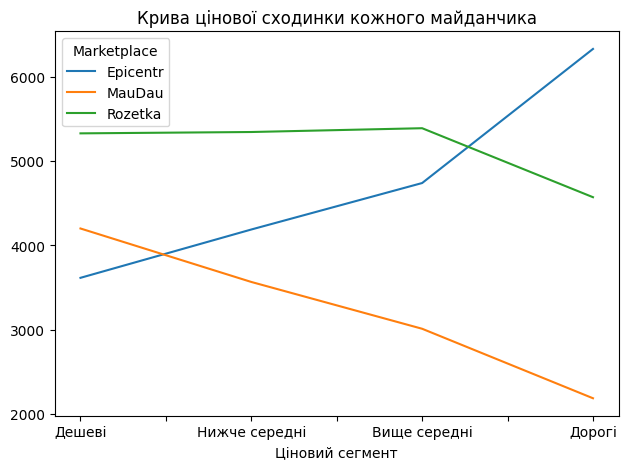
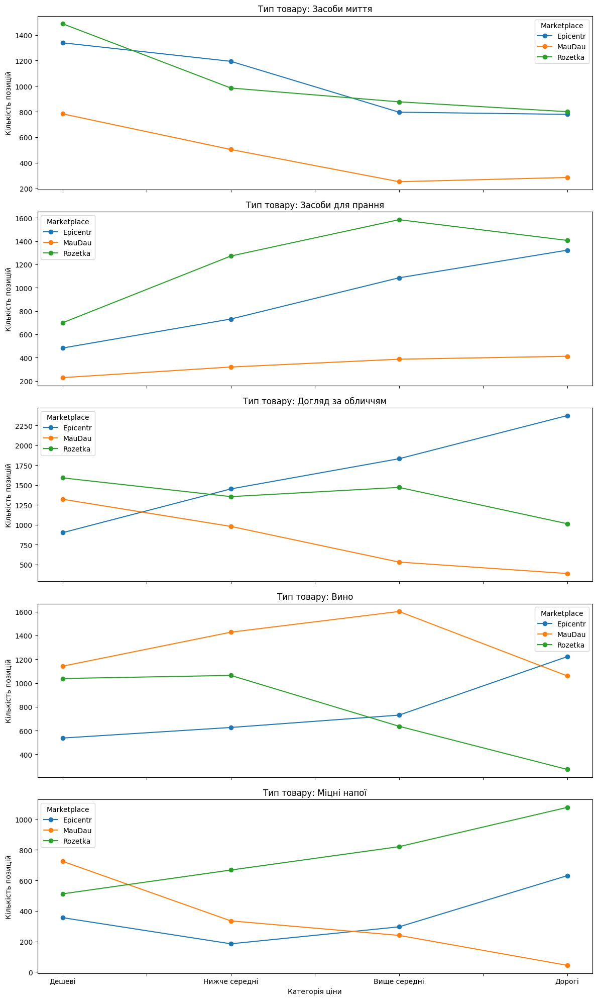
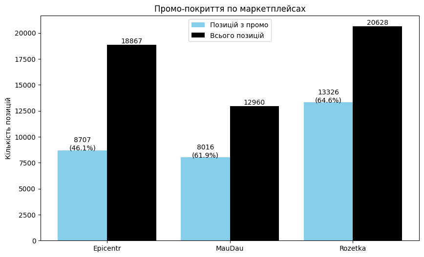
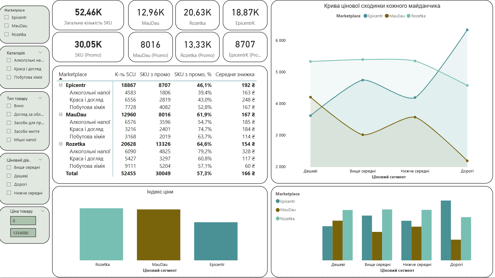

# Короткий аналіз основних конкурентів на момент проведення аналізу
[**датасет**](code/master_dataset_mre.xlsx) завантажений в період **6-8.12.2205**
[**код аналізу залежностей між конкурентами**](code/main_dataset.ipynb)

### Два основні конкуренти MauDau за схожим асортиментом, цільовою аудиторією та процесами:

- **ROZETKA**
- **EПІЦЕНТРК**

---

#### Чому ROZETKA?
- Найбільший онлайн-магазин в Україні, який є ключовим конкурентом для будь-якої e‑commerce платформи.
- Перетин цільової аудиторії: орієнтовані на українських онлайн‑покупців, які шукають побутові товари, косметику та товари для дому.
- Схожість з MauDau в операційних процесах виконання замовлень: оплата, доставка, самовивіз.
- Доволі схожа «агресивна» маркетингова стратегія щодо залучення аудиторії.
- Близький ціновий сегмент та політика.

#### Чому EПІЦЕНТРК?
- Найбільший онлайн-магазин побутових товарів та товарів для дому.
- Унікальний продавець будівельних матеріалів та меблів, що обмежує перетин із MauDau у цій категорії.
- Перетин цільової аудиторії: орієнтовані на українських онлайн‑покупців, які шукають товари для дому, продукти харчування (алкоголь), товари для відпочинку.
- Схожість з MauDau в операційних процесах виконання замовлень: оплата, доставка, самовивіз.
- Доволі схожа «агресивна» цінова політика при низькій відносній залученості знижок.

## Перетин певних категорій MauDau, Rozetka та ЕпіцентрК

Категорії:        | Косметика | Побутова хімія | Товари для дому | Електроніка | Будівництво/Інструменти
-----------------|-----------|----------------|----------------|-------------|------------------------
**MauDau**       | 🔵        | 🔵             | 🔵             |             | 
**Rozetka**      | 🔵        | 🔵             | 🔵             | 🔵          | 
**ЕпіцентрК**    | 🔵        | 🔵             | 🔵             |             | 🔵

## Перетин способів доставки MauDau, Rozetka та ЕпіцентрК

Спосіб доставки       | MauDau                                   | Rozetka                                     | ЕпіцентрК
--------------------|-----------------------------------------|--------------------------------------------|-----------------------------------------------
Доставка курʼєром    | ✅                                       | ✅                                          | ✅
Нова Пошта           | ✅                                       | ✅                                          | ✅
Укрпошта             | ✅                                       | ✅                                          | ✅
Meest                 | ✅                                       | ✅                                          | ✅
Самовивіз             | з Сільпо                                 | з магазинів "Розетка"                      | з гіпермаркетів та магазинів "Епіцентр"

## Детальний аналіз вищезгаданих майданчиків по 3-х категоріях: побутова хімія, краса і догляд, алкоголь.

### 1) Ємність і частка цінових сегментів по кількості доступних в продажу SKU

| Ціновий сегмент   | EpicentrK SKU | EpicentrK % | MauDau SKU | MauDau % | Rozetka SKU | Rozetka % |
|-------------------|---------------|-------------|------------|----------|-------------|-----------|
| Дешеві            | 3614          | 27.5        | 4199       | 32.0     | 5327        | 40.5      |
| Нижче середні     | 4187          | 32.0        | 3565       | 27.2     | 5343        | 40.8      |
| Вище середні      | 4738          | 36.1        | 3010       | 22.9     | 5388        | 41.0      |
| Дорогі            | 6328          | 48.4        | 2186       | 16.7     | 4570        | 34.9      |

### 2) Крива цінової сходинки кожного майданчика

## Висновок по 1. - 2. пунктах:

**Ємність і цінові сегменти:**
- Rozetka лідирує за кількістю SKU у всіх цінових сегментах категоріях (40-41%).
- MauDau має найменшу пропозицію, сконцентровану в дешевому ціновому сегменті (32% дешеві товари).
- EpicentrK показує найбільший акцент на дорогих товарах (~48%).

**Цінова сходинка:**
- Обидва конкуренти мають більш плавну цінову градацію порівняно з MauDau.
- Rozetka та EpicentrK пропонують ширший ціновий діапазон в кожній категорії товарів.
- У MauDau є потенціал для розширення пропозиції у середньому та високому ціновому сегментах.
- EpicentrK лідирує в кількості дорогих SKU у зв'язку з меншій долі промо-пропозицій.

| Marketplace | Категорія         | Позицій з промо | Всього позицій | Середня знижка | Промо-покриття на маркетплейсі % | Загальне промо-покриття % |
|-------------|-------------------|-----------------|----------------|----------------|----------------------------------|----------------------------|
| Epicentr    | Алкогольні напої  | 1806            | 4583           | 163.1          | 39.4                             | 4.8                        |
| Epicentr    | Краса і догляд    | 2823            | 6556           | 247.9          | 43.1                             | 7.6                        |
| Epicentr    | Побутова хімія     | 4082            | 7728           | 167.1          | 52.8                             | 10.9                       |
| MauDau      | Алкогольні напої  | 3596            | 6576           | 184.5          | 54.7                             | 9.6                        |
| MauDau      | Краса і догляд    | 2401            | 3216           | 183.8          | 74.7                             | 6.4                        |
| MauDau      | Побутова хімія     | 2019            | 3168           | 114.0          | 63.7                             | 5.4                        |
| Rozetka     | Алкогольні напої  | 6090            | 6090           | 327.7          | 100.0                            | 16.3                       |
| Rozetka     | Краса і догляд    | 5427            | 5427           | 117.2          | 100.0                            | 14.5                       |
| Rozetka     | Побутова хімія     | 9111            | 9111           | 60.5           | 100.0                            | 24.4                       |

- EpicentrK надає найменше знижок у відносних показниках до свого наявного асортименту.
- MauDau і Rozetka більше половини своїх товарів (з вибраних категорій) надають під знижки, що може говорити про моніторинг цін один в одного та схожу цінову політику з партнерами/постачальниками.

- MauDau лідирує в підкатегорії "Вино" у всіх цінових діапазонах окрім дорогого сегменту поступаючись тільки Епіцентру.

---

# 3) Ціновий індекс (рейтинг) MAUDAU до конкурентів
### 3.1. MauDau vs EpicentrK

**Загальний ціновий індекс MauDau відносно EpicentrK**
### 🏆 **75.0** 🏆

**MauDau в середньому на 25% нижчий у трьох позиціях по ціновій пропозиції**

### Ціновий індекс за категоріями

| Категорія          | Індекс | Коментар                      |
|--------------------|--------|-------------------------------|
| Алкогольні напої   | **60.6** | MauDau значно дешевший        |
| Краса і догляд     | **38.9** | MauDau суттєво дешевший       |
| Побутова хімія     | **80.3** | MauDau близький за ціною      |

### Детально:

#### Алкогольні напої
| Ціновий сегмент     | Індекс | Коментар                          |
|---------------------|--------|-----------------------------------|
| Дешеві              | 81.1   | близький до EpicentrK             |
| Нижче середні       | 85.1   | близький до EpicentrK             |
| Середні             | 76.3   | MauDau дешевший                     |
| Вище середні        | 65.7   | MauDau дешевший                     |
| Дорогі              | **38.0** | **MauDau значно дешевший**      |

#### Краса і догляд
| Ціновий сегмент     | Індекс | Коментар                          |
|---------------------|--------|-----------------------------------|
| Дешеві              | 81.9   | близький до EpicentrK             |
| Нижче середні       | 79.7   | MauDau дешевший                     |
| Середні             | 72.8   | MauDau дешевший                     |
| Вище середні        | 66.7   | MauDau дешевший                     |
| Дорогі              | 59.3   | MauDau дешевший                     |

#### Побутова хімія
| Ціновий сегмент     | Індекс | Коментар                          |
|---------------------|--------|-----------------------------------|
| Дешеві              | 86.7   | близький до EpicentrK             |
| Нижче середні       | 81.2   | близький до EpicentrK             |
| Середні             | 75.5   | MauDau дешевший                     |
| Вище середні        | 68.4   | MauDau дешевший                     |
| Дорогі              | **46.3** | **MauDau значно дешевший**      |

**Висновок:**  
MauDau відчутно дешевший в усіх категоріях, особливо в сегменті «вищої» цінової групи товарів:  
- дорогі алкогольні напої — на **62%** дешевше  
- дорога побутова хімія — на **53.7%** дешевше  
- краса і догляд загалом — на **61.1%** дешевше  
---
### 3.2. MauDau vs Rozetka

**Загальний ціновий індекс MauDau відносно Rozetka**
### 🏆 **102** 🏆
**MauDau в середньому на 2 % дорожчий за Rozetka**  
(але по окремих категоріях — значно вигідніший!)

## Ціновий індекс за категоріями товарів

| Категорія            | Індекс  | Коментар                              |
|----------------------|---------|---------------------------------------|
| Алкогольні напої     | **97.4**| майже однакові ціни                   |
| Краса і догляд       | **58.2**| **MauDau на 42% дешевший!**         |
| Побутова хімія       | **81.1**| MauDau відчутно дешевший              |

## Детально за ціновими сегментами

### Алкогольні напої
| Ціновий сегмент     | Індекс | Коментар                          |
|---------------------|--------|-----------------------------------|
| Дешеві              | 89.0   | MauDau дешевший                   |
| Нижче середні       | 99.0   | майже однаково                    |
| Середні             | 100.3  | Rozetka трохи дешевша             |
| Вище середні        | 100.0  | однакові ціни                     |
| Дорогі              | **74.0**| **MauDau значно дешевший**        |

### Краса і догляд
| Ціновий сегмент     | Індекс | Коментар                          |
|---------------------|--------|-----------------------------------|
| Дешеві              | 101.8  | Rozetka трохи дешевша             |
| Нижче середні       | 100.9  | майже однаково                    |
| Середні             | 101.2  | Rozetka трохи дешевша             |
| Вище середні        | 95.2   | MauDau дешевший                   |
| Дорогі              | 102.3  | Rozetka трохи дешевша             |

### Побутова хімія (доступні сегменти)
| Ціновий сегмент     | Індекс | Коментар                          |
|---------------------|--------|-----------------------------------|
| Дешеві              | 96.3   | MauDau дешевший                   |
| Нижче середні       | 98.3   | MauDau трохи дешевший             |
| (решта сегментів — близько 100, тобто паритет) |

**Висновок:**  

- Загальний індекс **102.0** — MauDau лише на 2% дорожчий за Rozetka  
- Але в категорії **Краса і догляд** економія може становити **до 42%**  
- **"Дорогий" алкоголь** - економія **26%**  
- **Побутова хімія** - економія **~15–20%** 

У ціновому з'язку Maudau і Rozetka спостерігається "парадокс Сімпсона". Коли загальні дані відображають відмінну ситуацію від сегментованих/детальних даних.

# Dashboard
[pbix](<code/Small dashboard PowerBI.pbix>)
